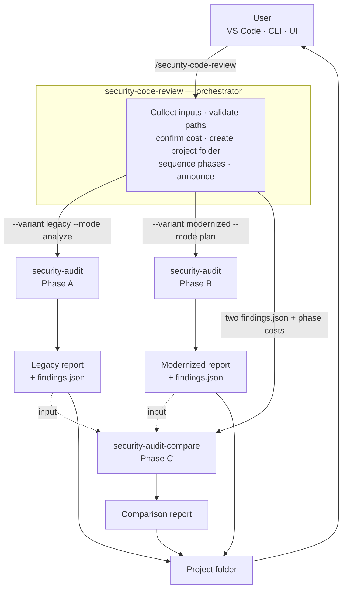
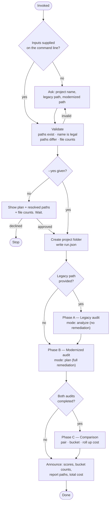

# Security Code Review Skills — Skills Design

**What it is.** A human-triggered agent that security-audits both sides of a software modernization
and reports what the migration did to the security posture. It is delivered as three Claude Code
skills, installs by copying folders, and runs identically from VS Code, the CLI, or a UI that shells
out to it.

**What it is not.** A background scanner, a CI gate that blocks merges, or a service. It runs when a
person asks it to, because each run costs real money and takes real time.

---

## 1. Why a skill, not a subagent

The obvious implementation of "an agent" in Claude Code is a subagent definition in
`.claude/agents/`. This system deliberately does not use one, for one decisive reason:

> **A subagent cannot ask the user a question.** It receives a prompt, works, and returns a result.

The required flow opens with three questions and a cost confirmation. Putting that in a subagent
would mean the caller has to collect the inputs anyway — at which point the subagent is only adding
an isolated context window and a layer of indirection between the user and the thing spending their
money.

Skills carry the opposite trade-off, and it is the one this workload wants:

| | Skill | Subagent |
|---|---|---|
| Can ask the user for input | **yes** | no |
| Runs in the main conversation | yes | no (isolated context) |
| User sees progress as it happens | **yes** | only the final result |
| Portable by copying a folder | yes | yes |
| Composable (skills invoking skills) | **yes** | limited |
| Keeps the main context clean | no | yes |

The last row is the real cost of this choice, and it is worth naming: a full review puts two audits'
worth of reasoning into one conversation. That is acceptable because the phases are sequential and
each one's durable output is a JSON file on disk, not context. A resumed or compacted session can
pick up from `run.json` and the phase artifacts without re-reading anything.

---

## 2. Component map



Three skills, one responsibility each:

| Skill | Responsibility | Knows about |
|---|---|---|
| `security-code-review` | Conversation, validation, sequencing, folder layout, cost segmentation, the final summary | Both other skills |
| `security-audit` | Audit **one** source tree | Nothing about migrations or the other side |
| `security-audit-compare` | Join **two** completed audits | The audit's `findings.json` contract only |

`security-audit` remains completely standalone — it predates this system and still works on its own
for any codebase. The orchestrator adds `--variant` and `--mode analyze` to it and nothing else. That
separation is what lets the audit engine be improved, or replaced, without touching the comparison
logic.

---

## 3. The operating flow



### Decision points that matter

**Validate before spending.** Every check in the `V` node is free; every one of them catches a class
of failure that would otherwise be discovered after a paid audit. A mistyped path is the single most
likely failure mode of the whole system, and it is fully preventable here.

**Confirm before spending.** The plan screen exists so the user sees resolved absolute paths and file
counts before committing. A file count two orders of magnitude off is the cheapest signal that a path
points somewhere unintended.

**Legacy is optional; modernized is not.** No legacy path means no Legacy report *and* no Comparison
report — there is nothing to compare against. The orchestrator says this explicitly rather than
producing a comparison against an imagined baseline.

**A failed phase does not abort the run.** If Phase A fails, Phase B still delivers. The comparison
is skipped and the reason is stated. Partial delivery with a named gap beats nothing.

---

## 4. Phase configuration, and why

| | Phase A — Legacy | Phase B — Modernized | Phase C — Comparison |
|---|---|---|---|
| Skill | `security-audit` | `security-audit` | `security-audit-compare` |
| `--mode` | `analyze` | `plan` | — |
| `--variant` | `legacy` | `modernized` | — |
| Remediation | **none** | full, per finding + roadmap | carried from Phase B |
| Score | current only | current + projected | both, joined |
| Runs when | a legacy path was given | always | both audits succeeded |

### Why the legacy audit produces no remediation

The legacy system is being replaced. A remediation plan for it would be work nobody intends to do,
and publishing one has a specific cost: it invites a reader to spend effort on the codebase that is
being retired. The Legacy report is a **diagnostic baseline** — its job is to establish what was
wrong before, so the comparison can say what the migration did about it.

`--mode analyze` therefore omits `remediation`, `verification`, `roadmap` and `scores.projected`
entirely, and the Legacy report's Limitations section states that the omission was deliberate. A
reader must never have to wonder whether the fixes were left out on purpose or simply forgotten.

### Why both sides must use the same depth

Audit depth controls how much manual review happens beyond the rule pass. A `deep` legacy audit
compared against a `quick` modernized one produces bucket counts that measure the effort spent, not
the codebases — and the resulting "the migration fixed 40 things" is an artifact of methodology. The
orchestrator passes one `--depth` to both phases; the comparison degrades itself to `partial` if it
ever sees a mismatch.

---

## 5. The comparison, which is the part that is actually hard

Comparing two audits is not a diff. The two codebases are in different languages with different file
layouts, and **nothing joins on file path**. `custlook.4gl:812` and `Services/CustomerService.cs:47`
may be the same vulnerability, and no mechanical rule can tell.

### The join key

```
                  ┌──────────────────────────────────────────┐
                  │  1. Build the FUNCTIONAL AREA MAP first  │
                  │     "Customer record CRUD"               │
                  │      legacy: custmaint.4gl, custlook.4gl │
                  │      modern: Pages/Customers.razor, …    │
                  └──────────────────┬───────────────────────┘
                                     ▼
       match = (weakness class)  ×  (functional area)
                     │                      │
              primary CWE, or        business capability,
              category + sink        not file path
                     └──────────┬───────────┘
                                ▼
                 confidence: Certain / Probable / Tentative
                       (weaker than Tentative = not a match)
```

The functional area map is built **before** any classification, from both inventories and both sets
of finding locations. It is the only thing that survives a language change, and two useful results
fall out of it for free: legacy areas with no modernized counterpart are candidate coverage risks,
and modernized areas with no legacy counterpart are where new-surface findings live.

### The five buckets

```
                         ┌─ in BOTH audits ───────────────────────► inherited
                         │
   compared finding ─────┼─ in LEGACY only ───────────────────────► resolved ──┐
                         │                                                     │
                         └─ in MODERNIZED only ─┬─ legacy had this ground,     │
                                                │  assessed, and was clean ───► introduced
                                                │                              │
                                                └─ could not exist in the      │
                                                   legacy architecture ───────► new-surface
                                                                               │
                    (unmapped area, or the other side never assessed) ────────► not-comparable
                                                                               │
                         ┌─────────────────────────────────────────────────────┘
                         ▼
            Why is it gone?   fixed-by-construction   → a real win
                              explicitly-remediated   → a real win
                              feature-not-migrated    → NOT a win: coverage risk
                              not-applicable          → neutral
```

Two distinctions in that diagram carry most of the design value:

**`introduced` vs `new-surface`.** A green-screen 4GL application has no CSRF risk, no CORS policy
and no cookie flags. Finding those gaps in the web rewrite is not a regression — it is the cost of
the new architecture. Filing every modernized-only finding as "introduced by the migration" produces
a document that reads as an indictment and gets dismissed for that reason. Separating the two is what
makes the genuine regressions visible, which is the entire point of the report.

**`resolved` is not automatically good news.** A vulnerability that disappeared because the feature
carrying it was never migrated has not been fixed — it is an open migration item, and it returns with
the feature. These are pulled into their own `coverageRisks[]` section, because a reader skimming
"12 resolved" will otherwise read twelve fixes where some are unbuilt features.

Guardrail: before anything is labelled `introduced`, the comparison confirms the legacy audit
actually **assessed** that category. If the legacy side never looked, there is no evidence the old
system was clean, and the item becomes `new-surface` or `not-comparable` instead. `introduced` is an
accusation, and it is held to the highest evidence bar in the report.

Every pairing publishes its confidence in the report, so a reviewer can see exactly where to check
the work. The full procedure is `security-audit-compare/references/matching-protocol.md`.

---

## 6. Layered architecture, inherited from the audit skill

Each phase runs the same three-layer pattern, and the split is the central design decision of the
whole system:

```
  Layer 1  DETERMINISTIC SENSOR     rules/*.json executed through the Grep tool
           ~109 ripgrep patterns    fast, cheap, reproducible, never inattentive
           output: CANDIDATES       explicitly not a verdict
                     │
                     ▼
  Layer 2  MODEL TRIAGE             reads surrounding code, establishes reachability,
           the part that matters    assigns confidence, dedupes to root causes, and adds
                                    the DESIGN flaws grep structurally cannot see —
                                    missing authorization, IDOR, tenant isolation
                     │
                     ▼
  Layer 3  DETERMINISTIC RENDER     the model authors findings.json; it never writes HTML
           template does the markup consistent output, no escaping bugs,
                                    tokens spent on analysis instead of markup
```

Each layer does what it is actually good at. Layer 1 never misses a pattern; Layer 2 supplies the
judgement a pattern cannot; Layer 3 removes an entire class of output bugs and keeps every report in
the folder visually identical.

The comparison skill reuses Layer 3 verbatim — `compare.part1.html` is built from the audit's
stylesheet plus comparison-specific rules, so the three reports in a project folder read as one
document set rather than three tools' output.

---

## 7. Output layout

```
<out>/<Project name>/
├── <Project> - Legacy - Security analysis report. - YYYY-MM-DD.html
├── <Project> - Modernized - Security analysis report. - YYYY-MM-DD.html
├── <Project> - Comparison - Security analysis report. - YYYY-MM-DD.html
└── .security-audit/
    ├── run.json                    orchestrator manifest: paths, depth, per-phase status
    ├── legacy/
    │   ├── findings.json           machine-readable record — input to Phase C
    │   ├── inventory.json
    │   ├── raw-hits.json
    │   ├── cost.json               this phase's measured cost
    │   └── cost-watermark
    ├── modernized/                 (same shape)
    └── comparison/
        ├── comparison.json
        ├── functional-areas.json   the join map — the audit trail for every pairing
        ├── pairings.json
        └── cost.json
```

The three HTML files sit at the top so the folder opens clean and can be circulated as-is.
`.security-audit/` holds the durable machine-readable record: it is what makes a re-run cheap, what
feeds `--baseline` on the next audit, and what Phase C reads. `findings.json` is explicitly **not** a
temp file — deleting it means paying for the audit twice.

---

## 8. Cost accounting

Cost is a first-class output, not a footnote. Every report carries tokens and dollars.

```
   transcript  ─────────────────────────────────────────────────────────►
               │◄── Phase A ──►│◄──── Phase B ────►│◄── Phase C ──►│
               ▲               ▲                   ▲               ▲
            mark A          mark B              mark C          report C
            report A        report B
```

Each phase marks a watermark in its own `.security-audit/<phase>/` directory before starting and
reports against it when it finishes. Because the phases are **sequential**, the transcript segments
do not overlap and the three phase costs sum to the run total. This is a second, quieter reason the
phases are not parallelized.

Each audit report shows its own phase's cost. The comparison report shows **all three phases and the
total**, so a reader who opens only the comparison still sees what the whole review cost — the figure
anyone approving the next one actually needs.

The collector has three interchangeable implementations (Python, bash+awk, PowerShell 5.1) producing
an identical `cost.json`; the first one that works is used. If none can run, the audit still
completes and the report records cost as `unavailable` — never a fabricated number. A phase that
could not be measured keeps its row in the comparison's cost table, marked not collected, so the gap
is visible rather than silently absent.

---

## 9. Portability

The hard requirement was no dependencies and no installation. The design satisfies it structurally
rather than by effort:

| Concern | How it is met |
|---|---|
| Scanning | The built-in `Grep`/`Glob`/`Read` tools. Ripgrep ships with Claude Code. No scanner binary. |
| Rules | Data (`rules/*.json`), not code. Nothing to execute or compile. |
| Report assembly | `cat` **or** `Get-Content` — one of bash/PowerShell is always present. |
| Cost accounting | Three interchangeable implementations; degrades to "not collected". |
| Reports | Self-contained HTML. No CDN, no fonts, no network. Opens from disk, attaches to email. |
| Install | Copy three folders. The installers only copy files. |
| Python | An **optional accelerator**, never a prerequisite, and it is never downloaded without explicit consent. |

The one intentional coupling: `security-audit-compare` reads `security-audit`'s cost collectors and
pricing table by relative path rather than shipping its own copy. Two pricing tables drift, and the
moment they do, the per-phase figures in the comparison stop reconciling against the per-run figures
in the other two reports. The skills are therefore installed and kept as siblings. If `security-audit`
is absent, the comparison still renders with cost marked not collected.

---

## 10. Integration surfaces

```
   VS Code extension ─┐
   Terminal CLI ──────┼──► /security-code-review  (interactive: asks, confirms)
                      │
   UI / CI / script ──┴──► claude --add-dir A --add-dir B
                             -p '/security-code-review
                                 --name "X" --legacy A --modernized B --out D --yes'
                                        │
                                        └──► reads: run.json + the three HTML files
```

The grants are not decoration. Both source trees normally sit outside the working directory, and a
directory outside the workspace is unreadable rather than empty — so a run without them audits
nothing and still emits a scored report. The UI derives them from its own form fields on every run,
which is why it cannot drift out of step with what the user typed.

The same skill serves both because **anything supplied on the command line is not asked for again**.
Supply everything plus `--yes` and the flow is fully non-interactive; supply nothing and it asks for
all three. There is no separate headless code path to keep in sync — which is the reason the UI
integration is a matter of passing arguments rather than a port.

For the planned UI, the integration contract is:

- **Input:** the three values, plus `--out` and `--depth`.
- **Progress:** the orchestrator's phase announcements on stdout.
- **Result:** `run.json` for machine-readable status and paths; the three HTML files for display.
- **Embedding:** the reports are static self-contained HTML — serve them, iframe them, or attach
  them, unchanged.

---

## 11. Deliberate constraints

These are properties to preserve, not incidental behaviours:

1. **Human-triggered only.** No scheduling, no watch mode. Each run costs money and warrants a
   decision.
2. **Read-only.** The system audits and reports; it never edits either codebase. Applying fixes is a
   separate, explicitly requested action.
3. **Evidence or it does not ship.** Every finding cites `file:line` with a real excerpt inside the
   audited root.
4. **No invented identifiers.** CWE/ATT&CK/CVE numbers are omitted rather than guessed. One wrong
   CVE discredits the whole document.
5. **Scope confinement per phase.** Each audit is rooted at its own tree and never traverses upward.
   The legacy audit cannot read the modernized tree, or vice versa.
6. **Never re-score during comparison.** Each audit owns its numbers; the comparison joins them. A
   recomputed third number would agree with neither report in the same folder.
7. **Report what was not done.** Skipped directories, unassessed categories, unmapped functional
   areas, rejected pairings, uncollected costs — all stated in Limitations. This section is what
   separates a security report from a marketing document, and an experienced reader checks it first.
